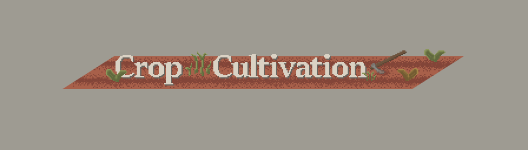

# Crop Cultivation
[](https://files.minecraftforge.net/maven/net/minecraftforge/forge/index_1.15.2.html)
[](https://github.com/Elenterius/CropCultivation)

<p align="center">
    <a href="#crop-cultivation"></a>
</p>

A Minecraft Forge Mod that takes out the simple out of Crop Farming.<br>
Currently focuses on soil management, and plant growth restrictions.

This mod modifies the growth **requirements**, growth **chance** and **yield** of all compatible Crops.

This mod will not add new crops. Use supported mods like Simple Farming.

## Mod Support
### Supported Crops
- Minecraft (exceptions: coca beans, saplings, sweet berry bush, mushroom)
- Simple Farming (exceptions: saplings/trees & bushes & grapes)
- XL Food Mod (exceptions: vanilla spice plant)

### Partial Support
- HarvestCraft Crops (only the crops overlapping with SimpleFarming, the remainder falls back to generic crop stats)

**Note:** HarvestCraft Crops contains over 70 crops and requires time to research/guesstimate the crop characteristics.
If you want full support consider helping out. 

### Compatible Crops
**Note:** not supported crops will fallback to generic behavior
- blocks extending CropsBlock
- blocks implementing IGrowable
    - should contain a Block Property for age (IntegerProperty with the identifier "age") if not crop yield will not be properly modified

### Farming For Blockheads
**Note:** you will not be able to create their fertilized farmland variants because vanilla farmland is no longer attainable in survival.
- made Red Fertilizer a `Nitrogen Fertilizer`
- made Green Fertilizer a `Phosphorus & Potassium Fertilizer`
- added `Soil Amendments` to the market
- added `Measuring Devices` to the market

### Growth Speed
Although Crop growth can be accelerated by other mods, the growth requirements still need to be fulfilled in most cases.
(Mods that use the IGrowable interface to grow a crop circumvent the growth restrictions since the CropGrowthEvent is not fired).

### Serene Seasons
Theoretically compatible, but not tested.


# Wiki
## Crop Growth & Yield
- growth requirements
    - soil moisture
    - soil macronutrients: `Nitrogen (N)`, `Phosphorus (P)`, `Potassium (K)`
    - soil pH inside tolerance
    - temperature inside tolerance
- growth chance
    - based on nutrient availability in soil which depends on soil pH
- crop yield
    - based on nutrient concentration in soil throughout its growth stages

Note:
- Unsatisfied plants will eventually starve
- Crops can be burned by over-fertilization


## Soils (Farmland)
```diff
! The Mod removes the ability to create vanilla farmland from vanilla dirt with the hoe
```
You can craft the different "non tilled" soil variants with dirt, sand and clay. Place them in the world and use your hoe on it.
You can use a shovel to convert tilled soil back to their respective dirt variant.


_From left to right: Vanilla Dirt, Sandy Soil, Loamy Soil, Silty Soil and Clayey Soil_

### Soil Properties
- Soil Texture
- Moisture
- pH
- Nutrients:
`Nitrogen (N)`,
`Phosphorus (P)`,
`Potassium (K)`
- Organic Matter Content
    - increases moisture capacity/retention of soil
    - increases nutrient retention of soil

#### Soil Moisture Level
Instead of vanilla crops requiring only moist farmland to grow well, 
each crop requires now the moisture level to be within a specific range to be able to grow.<br>
There are 10 soil moisture levels, ranging from 0 to 10:<br>
SEVERELY_DRY -> EXCESSIVELY_DRY -> ABNORMALLY_DRY -> DRY -> AVERAGE_0 -> AVERAGE_1 -> MOIST ->
ABNORMALLY_MOIST -> WET -> EXCESSIVELY_WET -> STANDING_WATER
<br><br> 

_From left to right: Very Dry, Average, Moist, Wet, Standing Water_
<br><br>

_SimpleFarming Rice growing on a "flooded" field (Wet, Excessively Wet, Standing Water)_

### Player Interaction
- Moisture capacity can be modified
  - by placing sand/gravel/clay/stone below soil
  - adding compost to soil which adds organic matter to the soil
- Organic Matter has a chance to decay into nutrients for the soil
- Overall pH doesn't change much by itself, the player is the only big influence through the application of liming or acidifying material
- Basically macronutrients and compost are the least things that should be checked before replanting

### Raised Soil Bed
Crafted by putting soil into a partially filled composter.
- the heat of the decomposing compost raises the soil temperature allowing plants to grow in colder regions
- keep the soil moist and occasionally reapply compost to keep the decomposition process going

### Environmental Influences
- Rain
  - can decrease soil pH
  - can wash away nutrients if the organic matter content of soil is low

## Plant Macronutrients
- Nitrogen (N)
    - high concentration in soil leads to faster crop growth
- Phosphorus (P)
    - high concentration in soil leads to better crop yield
- Potassium (K)
    - high concentration in soil leads to better crop yield

## Soil Amendments
### Compost
Applied to the soil to increase the organic matter content of soil.

### Fertilizer
Fertilizers increase the Nutrients in the soil.<br>
```diff
! The Mod removes the ability to use bone meal on compatible crops
```
**Note:** Apply Fertilizers to the soil instead of the crop.
- `Bone Meal`
- `Industrial Fertilizer`
- `Granite Dust`
- `Feather Meal`
- `Seaweed Meal`
- `Fish Meal`
- `Soybean Meal` `optional (requires simplefarming or harvestcraft)`
### Liming Material
Increases the Soil pH.
- `Lime Dust`
  - uncommon side product from cutting Rocks with the Stonecutter
- `Wood Ash`
  - process charcoal into dust with the mortar and pestle (unrealistic)
 <br>(make wood ash a waste product of burning/smelting wood logs in a furnace?)
### Acidifying Material
Decreases the Soil pH.
- `Blaze Powder`
- `Gunpowder`
- `Sulphur` `from simplysalty mod`

## Datapack
`data/cropcultivation/...`
### Item Tags
- `n_fertilizer`
  - contains already optional entry for `farmingforblockheads:red_fertilizer`
- `p_fertilizer`
  - contains already optional entry for `farmingforblockheads:green_fertilizer`
- `k_fertilizer`
  - contains already optional entry for `farmingforblockheads:green_fertilizer`
- `acidifying_material`
  - contains already optional entry for `simplysalty:sulphur` 
- `liming_material`
- `compost`
  - contains already optional entry for `cannycomposter:compost`
### Block Tags
- `default_growth`: crops/plants added to this tag will be excluded from the modified growth behavior, this does not prevent the consumption of nutrients!